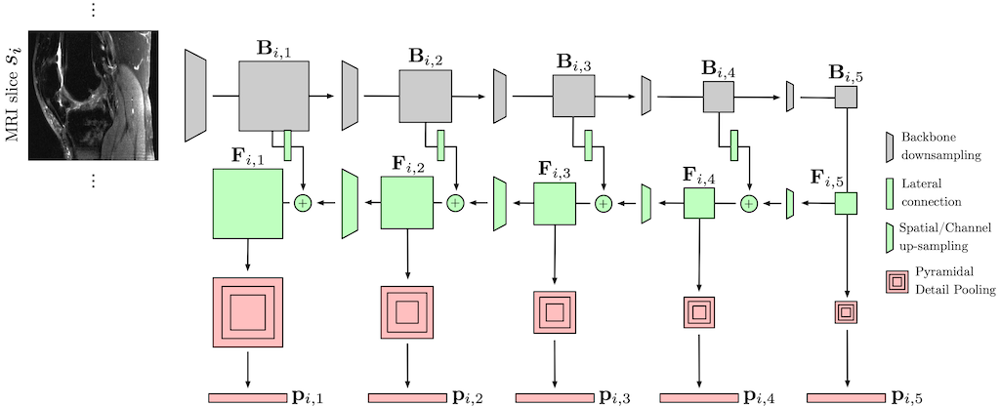

# MRPyrNet 

Official implementation of the MRPyrNet architecture proposed in the paper
[Improving MRI-based Knee Disorder Diagnosis with Pyramidal Feature Details](https://openreview.net/forum?id=7psPmlNffvg) presented at the International Conference on Medical Imaging with Deep Learning (MIDL) 2021.
 


## Abstract
*This paper presents MRPyrNet, a new convolutional neural network (CNN) architecture that improves the capabilities of CNN-based pipelines for knee injury detection via magnetic resonance imaging (MRI). Existing works showed that anomalies are localized in small-sized knee regions that appear in particular areas of MRI scans. Based on such facts, MRPyrNet exploits a Feature Pyramid Network to enhance small appearing features and Pyramidal Detail Pooling to capture such relevant information in a robust way. Experimental results on two publicly available datasets demonstrate that MRPyrNet improves the ACL tear and meniscal tear diagnosis capabilities of two state-of-the-art methodologies. Code is available at https://git.io/JtMPH.*

## Installation

Code has been developed and tested on Ubuntu 18.04 with Python 3.7, PyTorch 1.7.1, scikit-learn==0.22.2.post1, and CUDA 10.

#### Clone the GIT repository.  
```bash
git clone https://github.com/dontfollowmeimcrazy/MRPyrNet.git
```

#### Download the MRNet dataset. 
Download the official [MRNet dataset](https://stanfordmlgroup.github.io/competitions/mrnet/) and put wherever you want in your local machine.
Then, set the path to the MRNet folder into the variable ```DATA_PATH``` contained in the bash files ```train_mrpyrnet.sh``` located in the folders ```MRNet+MRPyrNet``` and ```ELNet+MRPyrNet```.
   
## Train and Test

Run the following commands
```bash
cd MRNet+MRPyrNet
bash train_mrpyrnet.sh 
```  
to run an experiment with the MRPyrNet applied to the [MRNet pipeline](https://journals.plos.org/plosmedicine/article?id=10.1371/journal.pmed.1002699). Brifely, This will train a MRNet+MRPyrNet instance for each view (axial, coronal, sagittal) for both the ACL and meniscus tear tasks. After, for each task, the script will train and test a logistic regressor combining the predictions of the three instances. Results, logs, and checkpoints for each experiment will be saved in the folder ```MRNet+MRPyrNet/experiments/```.

Run the following commands
```bash
cd ELNet+MRPyrNet
bash train_mrpyrnet.sh 
```  
to run an experiment with the MRPyrNet applied to the [ELNet pipeline](https://arxiv.org/abs/2005.02706). Brifely, This will train a single ELNet+MRPyrNet instance for the the ACL (axial view) and meniscus tear (coronal view) tasks. Results, logs, and checkpoints for each experiment will be saved in the folder ```ELNet+MRPyrNet/experiments/```.

## Contact

Feel free to open an issue on GitHub for any problems. Otherwise you can contact me via e-mail by writing to [matteo.dunnhofer@uniud.it](matteo.dunnhofer@uniud.it).

## Reference
If you find this work useful please cite
```
@InProceedings{Dunnhofer_2021_MIDL,
	author    = {Dunnhofer, Matteo and Martinel, Niki and Micheloni, Christian},
	title     = {Improving MRI-based Knee Disorder Diagnosis with Pyramidal Feature Details},
	booktitle = {Proceedings of the Fourth Conference on Medical Imaging with Deep Learning (MIDL)},
	year      = {2021}
}
``` 

### Acknowledgements 

This repository was built upon the code of [https://github.com/ahmedbesbes/mrnet](https://github.com/ahmedbesbes/mrnet) and of the [original MRNet](https://doi.org/10.1371/journal.pmed.1002699.s001).
